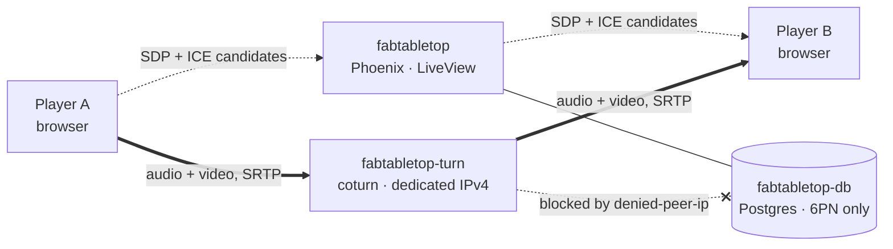
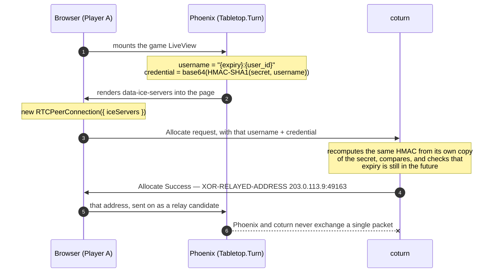

# How TURN actually works

Two players point webcams at their playmats. Getting that video between them is the hard
part — and coturn is what makes it work when nothing else does. This is the path a packet
takes, and what each knob in [`turnserver.conf`](turnserver.conf) does to it.

Deployment steps live in [`../fly/README.md`](../fly/README.md); this file is the *why*.

---

## The problem is NAT

Almost nobody has a public IP address. Your laptop has something like `192.168.1.42`, which
is meaningless outside your house. Your router translates that to one shared public address
on the way out — that's NAT.

NAT works fine for browsing, because *you* start every conversation. The router remembers
"192.168.1.42 asked for google.com" and knows where to send the reply. But WebRTC needs two
machines that have never spoken to each other to start sending each other video. Neither
router has an entry for the other side, so both drop the packets on the floor.

ICE (Interactive Connectivity Establishment) is how WebRTC solves this. Each browser gathers
every address it might be reachable on, calls each one a **candidate**, trades the list with
the other side, and tries every combination until one works.

## Three kinds of candidate

Every candidate a browser gathers is one of these. They're tried cheapest-first, and the
last one is the one we pay for.

| Type | Path | Cost | When it wins |
| --- | --- | --- | --- |
| `host` | `Browser A → 192.168.1.42 → Browser B` | free | Both players on the same LAN. Unroutable across the internet. |
| `srflx` | `Browser A → A's router → B's router → Browser B` | free | The good case, and the majority of connections. Media flows **directly between the two players**. |
| `relay` | `Browser A → coturn:49160 → Browser B` | bandwidth, billed twice | Hole-punching failed. The only path that works on symmetric NAT and on locked-down networks. |

**`host`** — what the OS reports on its network interfaces. Useful for two people in the
same house testing the app; dead on arrival otherwise.

**`srflx`** (server reflexive) — the browser asks a STUN server one question, *"what address
did this packet come from?"*, and the answer is its public IP and port. Both sides swap
those, punch through their own NATs simultaneously, and connect directly. No server in the
middle. We use Google's public STUN servers for this, which is why `Tabletop.Turn` always
returns them even when TURN is switched off.

**`relay`** — when hole-punching fails, the browser asks coturn to **hold a port open on its
behalf**. That port becomes A's address as far as B is concerned. Every frame of video
travels up to our server and back down. This is the fallback that makes the difference
between "the app works" and "the app works for some people."

## Why STUN isn't enough

If STUN tells you your public address, why would you ever need to relay? Because on some
routers **there is no such thing as "your public address"** — there's only your address *as
seen by one specific destination*.

That's a symmetric NAT. It allocates a fresh external port for every destination you talk
to, so the address STUN reports is only valid for talking to the STUN server:

| | What STUN told Player A | What A's router does for Player B |
| --- | --- | --- |
| internal | `192.168.1.42:51000` | `192.168.1.42:51000` |
| destination | `stun.l.google.com` | Player B |
| seen as | `203.0.113.7:`**`62001`** | `203.0.113.7:`**`62002`** |

A tells B "reach me at `203.0.113.7:62001`". B's packets arrive at `:62001`, which is bound
to Google. The router has no rule for them. Dropped.

> **Why this matters for us.** Symmetric NAT is common on **mobile carriers** and on
> corporate and guest wifi. A player on 5G very likely cannot connect without a relay. That
> is the entire reason coturn exists in this stack — and it's why testing from your home
> wifi proves nothing. Home routers are usually permissive enough that STUN alone succeeds.

## Where coturn sits

Three separate Fly apps. The important thing to notice is that **signalling and media take
completely different routes** — and coturn is never on the signalling path.

Phoenix brokers the offer/answer exchange over `GameChannel` so the two browsers can learn
each other's candidates. Once they agree on a pair, Phoenix drops out of the media path
entirely. If the connection ends up relayed, the video goes browser → coturn → browser and
never touches the Phoenix app.

> **Encryption.** WebRTC media is DTLS-SRTP encrypted end to end between the two browsers.
> coturn forwards ciphertext and **cannot see anyone's webcam**, even though every byte
> passes through it. TURN-over-TLS (`turns:`) doesn't change that — it encrypts the *control
> channel*, which hides the fact that you're using TURN from the local network. It's a
> firewall-traversal tactic, not a media privacy one.

## How a browser gets permission

coturn won't relay for just anyone — an open relay is a free proxy that anyone on the
internet will find and abuse within days. But we also don't want per-user TURN passwords in
a database. The REST-API scheme solves this with a shared secret and some arithmetic.

The elegant part is step 6. Phoenix and coturn share nothing but `TURN_SECRET` — no
database, no API, no network path between them. Both compute the same HMAC independently, so
coturn can verify a credential it has never seen, issued by a server it cannot reach. If the
two secrets ever drift apart, every allocation fails with `401` and the only symptom is that
relayed calls stop working.

> **Why the expiry is rounded.** coturn's `user-quota` counts allocations per *literal
> username string*. Since the username embeds an expiry timestamp, a naive `now + ttl` would
> produce a different username on every page load — so every refresh would look like a
> brand-new person and the quota would never bind to anyone. `Tabletop.Turn` rounds the
> expiry up to the next hour, making the username stable per user per hour.

## What an allocation physically is

When coturn accepts that Allocate request, it opens a real UDP socket on a real port from
the `min-port`–`max-port` range and holds it for the life of the call. That socket *is* the
allocation. Everything else follows from it:

- **The port range is your hard concurrency limit.** One port per allocation, so
  `49160-49259` means 100 simultaneous allocations. No amount of CPU changes that number —
  only widening the range does.
- **One allocation per peer connection, per player.** Both players relaying costs two. The
  phone-as-camera feature opens a *second* peer connection between desktop and phone, so a
  fully-relayed game with both players on phones costs four.
- **coturn must know its own public address.** The relay address it hands back in step 7 is
  what the opponent will send video to. On Fly the dedicated IPv4 lives on the edge proxy
  and is invisible inside the container, so coturn cannot discover it — `EXTERNAL_IP` is how
  we tell it, and it's why [`entrypoint.sh`](entrypoint.sh) refuses to boot without one.
- **Relayed traffic is billed twice.** Every frame arrives and then departs, so a relayed
  player consumes their bitrate in both directions on our bandwidth bill. `max-bps` is the
  ceiling that stops one call running away with it.

> **The open-relay trap.** A TURN server relays to whatever peer address a client names.
> Left unrestricted, anyone who finds our credentials could use coturn to reach anything it
> can reach — including `fdaa::/16`, the Fly private network where Postgres lives. The
> `denied-peer-ip` ranges in `turnserver.conf` are what close that door. The older
> `no-loopback-peers` option is **silently ignored** by coturn 4.x and must not be relied on.

## Every config knob, and what it does

| Setting | Where it acts |
| --- | --- |
| `use-auth-secret` | Turns on the REST scheme — step 6. Without it coturn expects real user accounts. |
| `TURN_SECRET` | The shared HMAC key. Must be byte-identical on the web app and the TURN app or every allocation 401s. |
| `EXTERNAL_IP` | The address coturn advertises in step 7. Wrong value ⇒ allocations succeed and media silently goes nowhere. |
| `realm` | Sent in the 401 challenge before step 5. Cosmetic for us, but must match what the client is configured for. |
| `listening-port` | Where the Allocate request lands — `3478`, TCP and UDP. Fly also maps `443` here for TLS. |
| `min-port` / `max-port` | The pool the relay socket is drawn from. Hard cap on concurrent allocations. |
| `total-quota` | Server-wide allocation ceiling. Set to match the port count so you get a clear log line rather than port exhaustion. |
| `user-quota` | Per-username ceiling — the reason the credential expiry is quantised. |
| `max-bps` | Per-allocation bandwidth ceiling. The cost guard. |
| `denied-peer-ip` | Refuses to relay toward private ranges. Closes the open-proxy hole. |
| `TURN_URLS` | What the browser is told to try. Every URL listed means another allocation per client during gathering. |

## Telling whether it works

There's one thing to look for: a candidate whose type is `relay`. Everything else is noise.

- ✅ **Trickle ICE, from a mobile network.** Paste a TURN URL plus a credential minted by
  `Tabletop.Turn.ice_servers("test")` into the
  [WebRTC sample tester](https://webrtc.github.io/samples/src/content/peerconnection/trickle-ice/).
  A row of type `relay` means it works. Do this on cellular — home wifi will pass whether or
  not TURN is functioning.
- ✅ **`chrome://webrtc-internals` during a real game.** Find the nominated candidate pair.
  `relay` on either side means coturn carried that call. This is also how you measure what
  fraction of real games need the relay at all.
- ✅ **`fly logs --app fabtabletop-turn`.** coturn logs allocations and refusals to stdout. A
  wall of `401` means the two `TURN_SECRET` values have drifted; `allocation quota reached`
  means the port range is too small.
- ❌ **Only `host` and `srflx` candidates.** coturn isn't reachable, the credentials are
  being rejected, or the port isn't routed. Check `fly logs` first — if nothing appears
  there at all, the Allocate request never arrived and the problem is the network path, not
  the auth.

---

Reference for coturn 4.12 on Fly.io. Config in this directory;
credential minting in [`tabletop/lib/tabletop/turn.ex`](../../tabletop/lib/tabletop/turn.ex).
